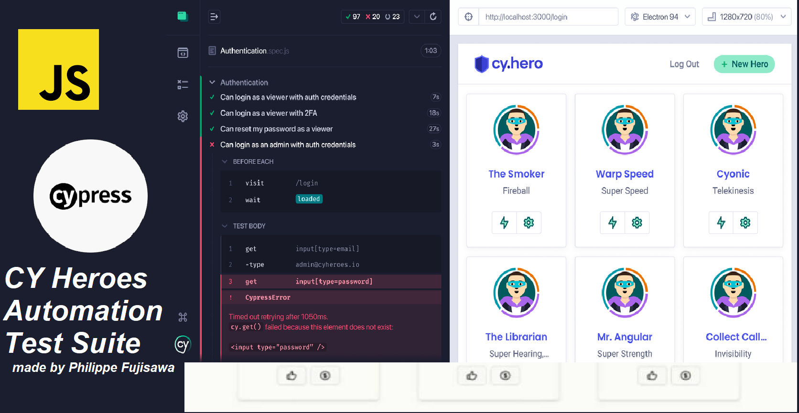

# Aplicação Demo Cypress Heroes


_Bem-vindo ao Cypress Heroes App. Este projeto demonstra minha proficiência em Garantia de Qualidade (QA) e automação de testes utilizando Cypress. A aplicação serve como uma demonstração abrangente da minha capacidade de desenvolver, testar e manter aplicações web robustas._

---

## Visão Geral do Projeto

A Aplicação Demo Cypress Heroes é um projeto full-stack composto por um frontend em React utilizando [Vite](https://vitejs.dev/) e um backend em [NestJS](https://nestjs.com/). Foi projetada para simular um cenário do mundo real onde usuários podem se registrar, fazer login e realizar várias ações. Este ambiente fornece uma base sólida para implementar e demonstrar estratégias de testes ponta a ponta (end-to-end).

---

## Iniciando o Projeto

Para configurar o projeto localmente, siga estas etapas:

### 1. Clone o repositório:

```bash
git clone https://github.com/philfujisawa/cypress-heroes.git
cd cypress-heroes
```

### 2. Instale as dependências:

```bash
npm install
```

### 3. Configure o ambiente:

```bash
npm run setup
```

### 4. Inicie o servidor de desenvolvimento:

```bash
npm run dev
```

+ A aplicação estará acessível em: http://localhost:3000.

## Executando os Testes
Este projeto inclui uma suíte de testes automatizados para garantir a funcionalidade e confiabilidade da aplicação.

+ **Testes End-to-End**: Validam fluxos e interações do usuário.

**Abra outro terminal, navegue até o diretório principal cypress-heroes, acesse a pasta `client` e execute os testes com o comando abaixo:**

```bash
npx cypress open
```

#### Seed e Reset do Banco de Dados

O banco de dados é populado pelo script **server/prisma/seed.ts** durante a configuração inicial. Se, a qualquer momento, você quiser redefinir o banco de dados para o estado inicial, execute:

```bash
npm run resetdb
```

## Variáveis de Ambiente

O aplicativo cliente utiliza uma variável de ambiente chamada `VITE_API_URL` para determinar a URL da API backend. Por padrão, ela é configurada como "http://localhost:3001" para uso no modo de desenvolvimento, mas deve ser sobrescrita em outros ambientes/modos.

Obrigado por conferir este projeto!