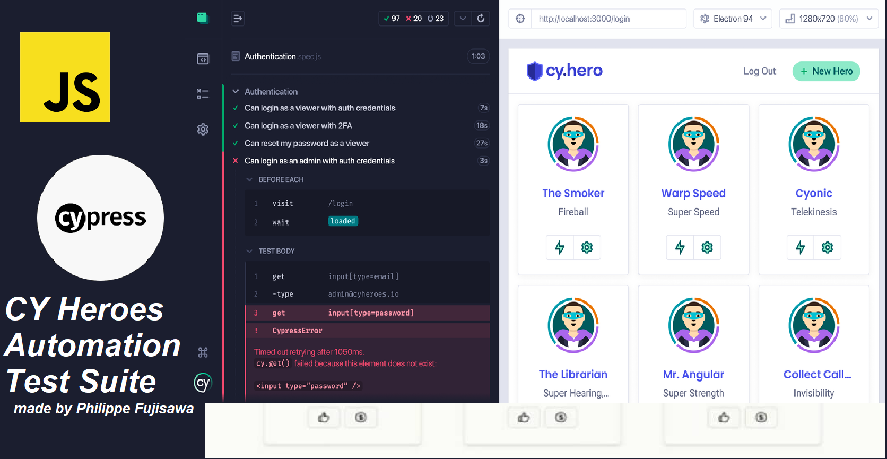

# Cypress Heroes Demo Application


_Welcome to Cypress Heroes App. This project showcases my proficiency in Quality Assurance (QA) and test automation using Cypress. The application serves as a comprehensive demonstration of my ability to develop, test, and maintain robust web applications._

**Para README em Português acessar no repositório o documento README-PTBR.md**

## Project Overview

The Cypress Heroes Demo Application is a full-stack project comprising a React frontend [Vite](https://vitejs.dev/) and a NestJS backend [NestJS](https://nestjs.com/). It is designed to emulate a real-world scenario where users can register, log in, and perform various actions. This setup provides a solid foundation for implementing and demonstrating end-to-end testing strategies.

## Getting Started

To set up the project locally, follow these steps:

### 1. Clone the repository:

```bash
git clone https://github.com/philfujisawa/cypress-heroes.git
cd cypress-heroes
```

### 2. Install dependencies:

```bash
npm install
```

### 3. Set up the environment:

```bash
npm run setup
```

### 4. Start the development server:

```bash
npm run dev
```

+ The application will be accessible at http://localhost:3000.

## Running Tests
This project includes a suite of automated tests to ensure the application's functionality and reliability.

+ **End-to-End Tests**: Validate user flows and interactions.

**Please open another terminal and inside main cypress-heroes directory, enter inside folder named `client` and execute the tests.**

```bash
npx cypress open
```

#### Database seeding and resetting

The database is seeded from the **server/prisma/seed.ts** script when you set up the app. If at any time you want to reset the database back to its initial state, run:

```bash
npm run resetdb
```

## Environment Variables

The client app uses an environment variable to know what the URL is for the
backend api named `VITE_API_URL`. It defaults to "http://localhost:3001" for use
in dev mode, and should be overriden in other environments/modes.

Thank you so much!